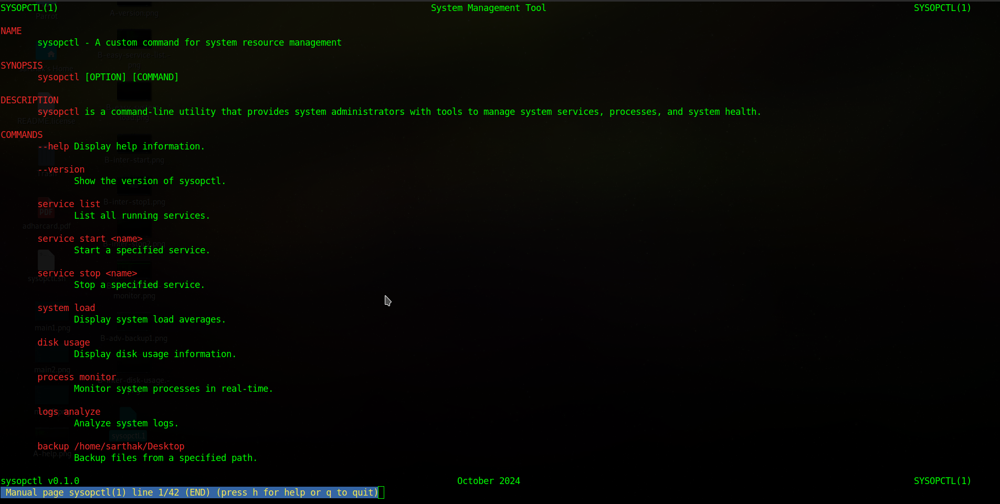
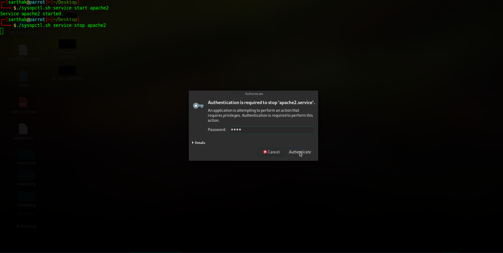
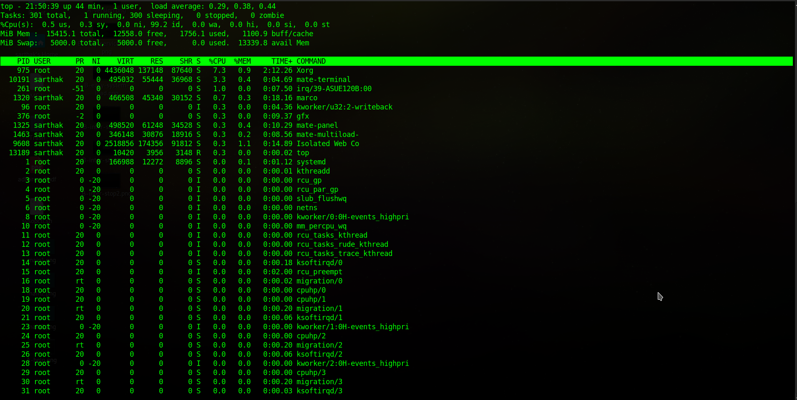
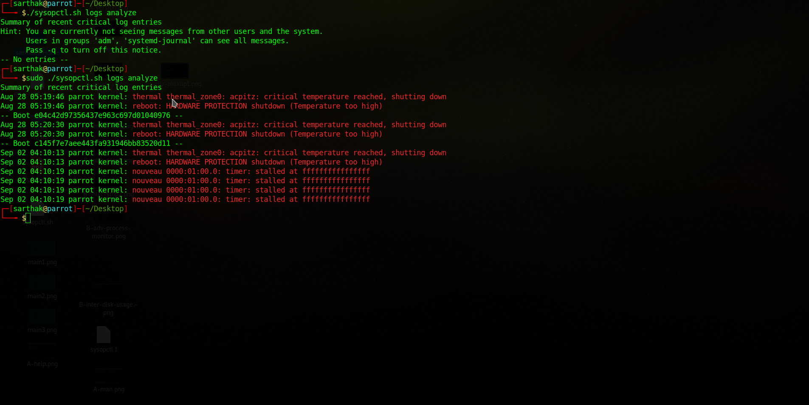
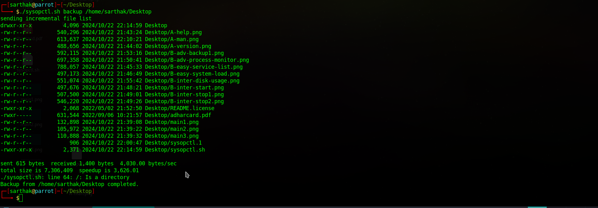

# sysopctl

Task - 2 of XenonStack Technical task:

`sysopctl` is a custom Linux command-line tool designed for system administrators. It allows users to manage system resources, services, view logs, monitor processes, and backup files easily through a single interface.

## Features

-   **Service Management**: Start, stop, and list system services.
-   **System Load Monitoring**: View system load averages.
-   **Disk Usage**: Check disk usage across all partitions.
-   **Process Monitoring**: Monitor system processes in real-time.
-   **Log Analysis**: Show recent critical log entries.
-   **Backup**: Backup files from a specified path.

## Prerequisites

Before you begin, make sure your system meets the following requirements:

-   A Linux system (e.g., Ubuntu, Debian, CentOS, etc.)
-   `journalctl` installed (for log analysis)
-   `rsync` installed (for backups)

## Installation

1. **Clone the repository**:

    ```
    git clone https://github.com/mr-anubhavtiwary/XenonStack-TT.git
    cd Task-2-Linux/mainScript
    ```

2. **Manual Page**

    1. _Install the manual page by copying it in the path below and saving man._

    ```
    sudo cp sysopctl.1 /usr/local/share/man/man1/
    sudo mandb
    ```

    2. _To view the manual page._

    ```
    man sysopctl
    ```

    

3. **Make the script executable**

    ```
    chmod +x sysopctl.sh
    ```

4. **Run the following command to get help on how to use**

    ```
    ./sysopctl.sh --help
    ```

5. **Available Commands**

    1. _Display help information about the tool._

    ```
    ./sysopctl.sh --help
    ```

    

    2. _Show the version of the tool._

    ```
    ./sysopctl.sh --version
    ```

    

    3. _List all running services._

    ```
    ./sysopctl.sh service list
    ```

     4. _Display current system load averages._

    ```
    ./sysopctl.sh system load
    ```

    

    5. _Start the specified service (e.g., apache2)._

    ```
    ./sysopctl.sh service start apache2
    ```

    

    6. _Stop the specified service._

    ```
    ./sysopctl.sh service stop apache2
    ```

    
    

    7. _Show disk usage statistics._

    ```
    ./sysopctl.sh disk usage
    ```

    

    8. _Monitor system processes in real-time (similar to top)._

    ```
    ./sysopctl.sh process monitor
    ```

    

    9. _Analyze and display recent critical log entries._

    ```
    sudo ./sysopctl.sh logs analyze
    ```

    

    10. _Backup files from the specified path to a pre-defined backup directory._

    ```
    ./sysopctl.sh backup <path>
    ```

    

6. **Example**

    ```
    ./sysopctl.sh service list
    ./sysopctl.sh service start apache2
    ./sysopctl.sh service stop apache2
    ./sysopctl.sh system load
    ./sysopctl.sh disk usage
    ./sysopctl.sh process monitor
    sudo ./sysopctl.sh logs analyze
    ./sysopctl.sh backup /path/to/your/files
    ```
